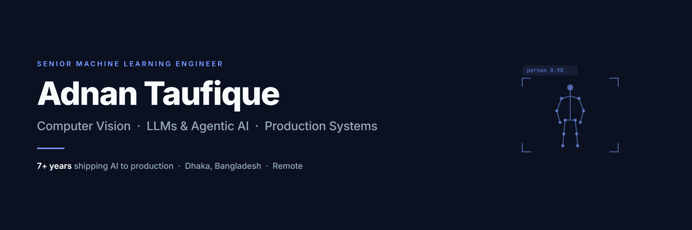

### Hi, I'm Adnan

Senior ML engineer, 7+ years. I build computer vision and agentic AI systems and get them into production, across healthcare, fashion e-commerce, real estate, and automotive. I handle the whole path: model training, inference optimization, the backend around it, and deployment. What I care about is ML that holds up under real load, not notebooks that only demo well.

I'm pragmatic about tools: custom code, a managed service, or a framework, whichever fits the problem.

**Focus**

- **Computer vision** — detection, segmentation, classification, and tracking; medical imaging, retail, document understanding
- **LLMs & agentic systems** — multimodal pipelines, agent backends, OCR/extraction, cost-aware integration
- **Production & MLOps** — ONNX / Triton serving, Docker, Kubernetes, sub-100ms inference under load
- **Data engineering** — scraping and pipelines at 500K+ records/day

**Stack**

         

**Selected work**

- **Healthcare imaging** — eczema/psoriasis severity from a single full-body image: detection, segmentation, and automated BSA/EASI scoring, deployed for clinical-grade CPU inference.
- **Fashion trend platform** — scraped 40+ sites and processed 500K+ products/day, using vision LLMs for attribute extraction and trend analysis.
- **CruiseIQ** — AI agent backend for a car-buying assistant: vehicle search, deal scoring, and market analysis.
- **Wound assessment** — YOLO wound segmentation and measurement, integrated into a HIPAA-compliant EMR workflow.

Most of this lives in private and client repos, so I'm happy to walk through specifics.

**Publication** — *Handwritten Bangla Character Recognition using Inception CNN*, IJCA (2018).

**Connect**

 

Open to senior ML / computer-vision roles and select consulting.
